# ♻️ EchoWise-AI: Zero-to-Hero Waste Management Platform

<div align="center">


</div>
<div align="center">

_An AI-powered(Gemini 3) decentralized waste management system that rewards users for reporting and collecting waste, creating a sustainable community-driven approach to environmental protection._


## 🌍 "Built for Community - Pioneering Environmental Innovation"

[🚀 Live Demo](https://echo-wise-ai.vercel.app/)

</div>

---

## 📑 Table of Contents

-   [🌍 Addressing UN Sustainable Development Goals](#-addressing-un-sustainable-development-goals)
-   [🚨 The Problem](#-the-problem)
-   [💡 Our Solution](#-our-solution)
-   [🚀 Features](#-features)
-   [💻 Technical Architecture](#-technical-architecture)
-   [🛠️ Tech Stack](#️-tech-stack)
-   [🚀 Getting Started](#-getting-started)
-   [🧠 AI Integration](#-ai-integration)
-   [🔗 Blockchain Integration](#-blockchain-integration)
---

## 🌍 Addressing UN Sustainable Development Goals

This project directly contributes to multiple UN SDGs:

| SDG | Goal | Our Impact |
| --- | --- | --- |
| ♻️ **SDG 12** | Responsible Consumption and Production | Creates an incentivized ecosystem for waste recovery and recycling. |
| 🏙️ **SDG 11** | Sustainable Cities and Communities | Enhances municipal waste management through community-driven reporting and collection. |
| 💰 **SDG 8** | Decent Work and Economic Growth | Creates new economic opportunities for waste collectors and rewards community contributions. |
| 🤝 **SDG 17** | Partnerships for the Goals | Leverages private tech (AI, Blockchain) to solve public environmental problems. |

---

## 🚨 The Problem

### Current State of Waste Management:

Traditional waste management systems face several critical challenges:

-   **⬇️ Low Engagement:** Lack of incentive for citizens to report illegal dumping or littering.
-   **🔍 Lack of Real-time Data:** Municipalities lack accurate, real-time data on waste location and type for efficient resource allocation.
-   **💰 High Operational Costs:** Inefficient routing and manual verification processes drive up collection costs.
-   **🔒 Lack of Transparency:** Centralized systems can lack public trust regarding waste fate and impact reporting.

### Real-World Impact:

Unreported Waste Pile: 100 kg of mixed plastic
Potential Time to Discovery: 3-5 days
Our Solution: Reported in <5 minutes with AI verification

This delay leads to environmental pollution, attracts pests, and creates public health hazards.

---

## 💡 Our Solution

### EchoWise-AI: An Incentivized Ecosystem

A full-stack, community-driven platform that leverages AI for verification and Web3 for gamified rewards, solving the engagement and transparency problems of waste management.

#### 🔬 How It Works

1.  **AI Verification:** Users report waste via an image; Google Gemini 3 AI instantly verifies the type and quantity.
2.  **Gamified Rewards:** Verified reports earn users ERC-20 compliant tokens, tracked on a transparent leaderboard.
3.  **Real-Time Tasks:** Reported waste immediately becomes a collection task on an interactive map.
4.  **Decentralized Access:** Web3Auth provides secure, multi-wallet authentication for all users.

#### 🎯 Key Innovation

EchoWise-AI is unique because it combines **Gemini AI's computer vision** for real-world environmental data capture with a **Web3 token economy** to directly incentivize positive community action, turning a civic duty into a rewarding activity.

---

## 🚀 Features

### ♻️ Core Functionality

| Feature | Description | Impact |
| --- | --- | --- |
| **AI-Powered Waste Detection** | Uses Google Gemini 3 AI for image recognition, classification, and quantity estimation. | Ensures report accuracy and enables data-driven collection. |
| **Gamified Reward System** | Earn points/tokens for reporting and collecting, tracked on a leaderboard. | Boosts user engagement and participation through competition. |
| **Interactive Mapping** | Google Maps Integration for visual waste location and Route Optimization for collectors. | Increases collection efficiency and reduces fuel costs. |
| **Web3Auth Authentication** | Secure, decentralized login with multi-wallet and social provider support. | Provides self-sovereign identity and seamless cross-platform access. |
| **Impact Analytics** | Real-time tracking of waste collected (kg) and estimated CO2 offset. | Provides immediate feedback on environmental contribution. |

### 💻 Technical Architecture

```mermaid
graph TB

    subgraph "User Interface"
        A[🌐Frontend &#124; Next.js]
    end

    subgraph "Application Core"
        B[💻 Backend &#124; Next.js API Routes]
        C[🔑 Auth &#124; Web3Auth]
        D[🗄️ Database &#124; PostgreSQL Neon]
    end

    subgraph "External AI/Services"
        E[🧠 AI &#124; Google Gemini 3 AI]
        F[🗺️ Mapping &#124; Google Maps API]
        G[🔗 Blockchain &#124; Ethereum/Ethers.js]
    end

    %% Frontend Interactions
    A -- API Request --> B
    A -- Login Request --> C
    A -- Fetches Maps Data --> F

    %% Core Logic Flow
    B -- Data CRUD --> D
    D -- Query Results --> B
    B -- Classification Request --> E
    E -- AI Prediction --> B
    C -- Token/Session --> B
    C -- Wallet/Identity --> G

    %% Final Response
    B -- API Response --> A

```



---
## 🛠️ Tech Stack

### Frontend Stack

```
⚡ Next.js 14 (App Router) - Full-stack React framework
🎨 Tailwind CSS - Utility-first styling
📘 TypeScript - Type-safe development
🧩 RadixUI, LucideReact - Accessible UI components
```

### Backend Stack

```
🐍 Next.js API Routes - Server-side functionality
💿 Drizzle ORM - Type-safe database operations
🐘 PostgreSQL (Neon) - Robust relational database
```

### AI & Web3

```
🧠 Google Gemini 3 Flash (Multimodal Vision)
🔗 Web3Auth - Decentralized authentication
⛓️ Ethereum (Sepolia Testnet) - Smart contract integration
```

### Infrastructure

```
☁️ Vercel - Deployment and hosting platform
🗺️ Google Maps API - Location services and mapping
```
---

## 🚀 Getting Started

### Prerequisites

```bash
Node.js (v20 or higher)
Yarn package manager
Git for version control
```

### 🌐 Installation

```bash
# Clone repository
git clone (https://github.com/ayushkumar1991/EchoWise-AI.git)
cd EchoWise-AI

# Install dependencies
npm install

# Setup environment variables
cp .env.example .env.local 
# (Configure variables as per Environment Setup)

# Start development server
npm dev
```

### Environment Variables

```bash

# Google Services
NEXT_PUBLIC_GOOGLE_MAPS_API_KEY="your_google_maps_api_key"
NEXT_PUBLIC_GEMINI_API_KEY="your_gemini_api_key"

# Application
NEXT_PUBLIC_APP_URL="http://localhost:3000"
```

---

## 🔬Why Gemini 3?

### We chose Gemini 3 Flash because:

- **⚡ Ultra-fast inference for real-time UX.**
- **🖼️ Strong multimodal vision understanding.**
- **📊 Structured JSON output capability.**
- **🧠 Context-aware environmental reasoning.**

**Gemini acts as our Environmental Intelligence Engine.**

## 🧠AI Integration

### Google Gemini AI Implementation
- **The platform integrates Google's Gemini AI for waste recognition and classification.**
- **Image Analysis Process: Users upload images → Gemini AI analyzes images → Classification (type, quantity, confidence score) → Validation.**
- **Verification System: Reports require a minimum 70% confidence threshold for automatic approval. Lower confidence results are flagged for manual community review.**

---
## 🔗Blockchain Integration

### Web3Auth Authentication
- **Seamless UX: Offers multi-provider support (social logins + crypto wallets).**
- **Security: Provides decentralized identity and non-custodial key management.**
---

## 🔐Web3 + AI = Trust + Intelligence

-**Gemini 3 provides:->Intelligent classification**

-**Web3Auth provides:->Decentralized identity**

Together:-> Transparent, trust-driven environmental data system
---

<div align="center">

🌱 Built with Gemini 3 for a Cleaner Future

</div>

<div align="center">

</div>
# EchoWise-AI

